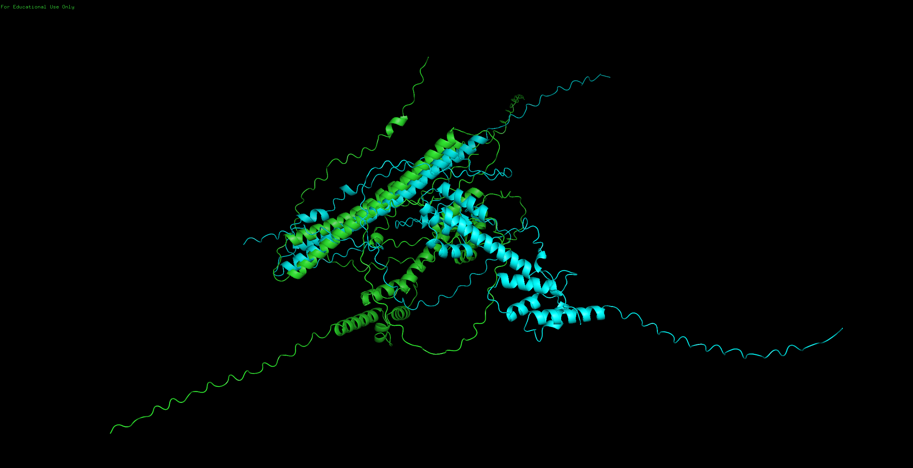

# Biological-Datasets-for-Computational-Physics
In this repository, you will find reports, code, and data output for the projects related to the course Biological Datasets for Computational Physics (AY 2023/2024, Master degree program in Physics of Data, University of Padova).

  
   
  <em>Two representative structures of Arc Human (Uniprot: Q7LC44)</em>

